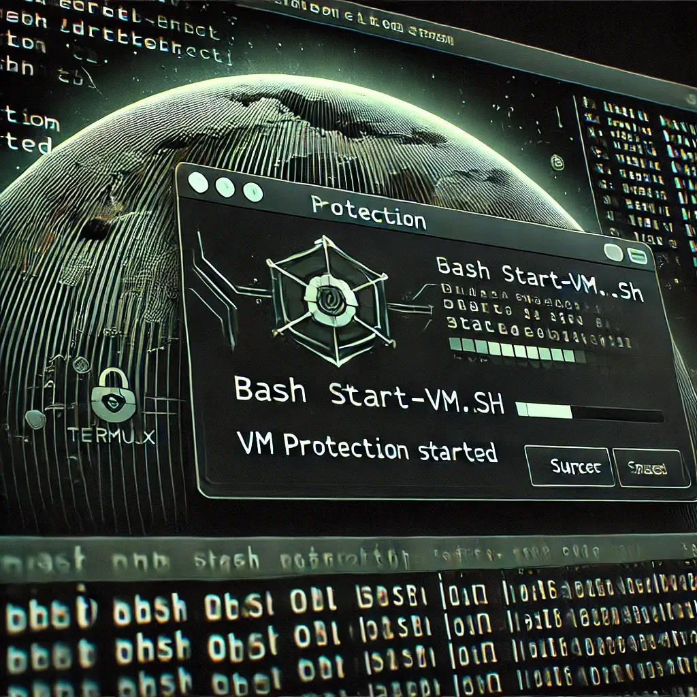
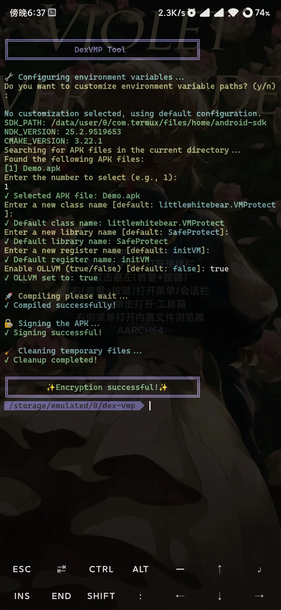

# DexVMP

Run dalvik bytecode based on dex-vm to protect dex

## Modification Instructions

Below are the steps to modify and enhance the DexVMP:

### 1. Merge VM Library
Combine the VM library.

### 2. Random String Encryption
Apply random string encryption to obfuscate the code.

### 3. Custom VM Class Name
Specify a custom class name for the VM.

### 4. Custom VM Library Name
Define a custom name for the VM library.

### 5. Customized VM Registration Name
Set a custom registration name for the VM.

### 6. Support Synthetic Method Protection
Enable protection for synthetic methods.

## Configuration

### Termux command Install NDK [r25c](https://github.com/Party233/dexvmp/releases/tag/ollvm):
```
cd && pkg upgrade && pkg install wget && wget https://github.com/Party233/dexvmp/raw/master/termux-ndk.sh --no-verbose --show-progress -N && chmod +x termux-ndk.sh && bash termux-ndk.sh
```

### Set up NDK and Environment Variables

```bash
export SDK_PATH=/data/user/0/com.termux/files/home/android-sdk
export NDK_PATH=/data/user/0/com.termux/files/home/android-sdk/ndk/25.2.9519653
export CMAKE_PATH=/data/user/0/com.termux/files/home/android-sdk/cmake/3.22.1
```  

### Start VM Protection(Termux)

```  bash
bash start-vm.sh
```  

### Console execution.

```  bash
java -jar vm-protect.jar apk input.apk convertRules.txt mapping.txt
```  

## Project Source

This project is forked from [nmmp](https://github.com/maoabc/nmmp)

---
